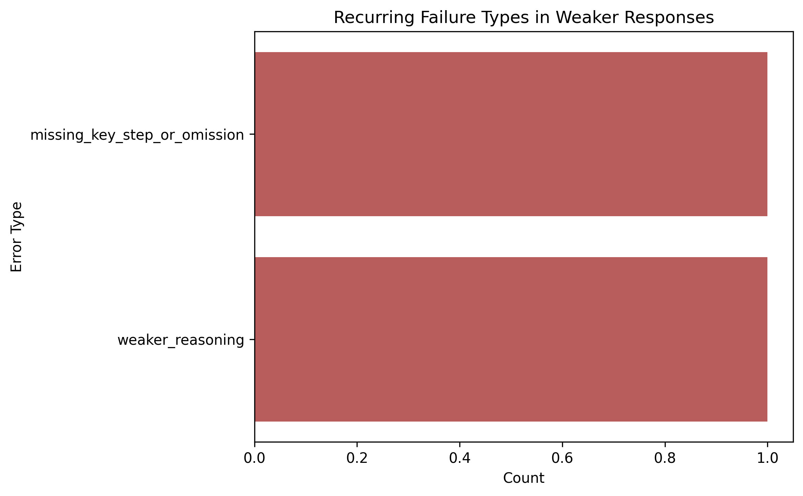
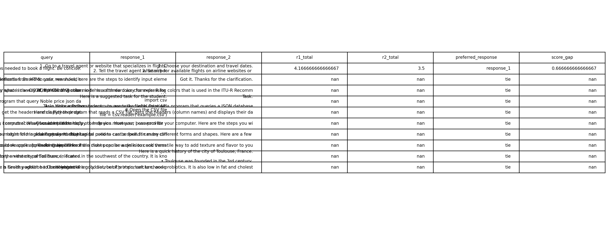

# AI-Pairwise-Response-Evaluation-Using-Preference-Based-Scoring-and-Error-Analysis
This project evaluates AI-generated responses using side-by-side comparison. It identifies which response is better, why it is preferred, and what quality dimensions drive those decisions, with a focus on clarity, completeness, and reasoning quality.

# 🧠 AI Evaluation of Pairwise Responses Using Preference Dissection Dataset

## 📌 Overview
This project evaluates AI-generated responses using a **side-by-side (SxS) comparison framework**.

Each record contains:
- one query  
- two competing AI responses  

The goal is to determine:
- which response is better  
- why it is better  
- what drives preference decisions  

---

## 🎯 Objectives
- Identify which of two responses is stronger  
- Understand what drives preference decisions  
- Detect recurring failure patterns in weaker responses  
- Evaluate consistency across response comparisons  

---

## 📊 Dataset
- **Preference Dissection Dataset**  
- Format:
  - query  
  - response_1  
  - response_2  

---

## ⚙️ Methodology

### ✅ Evaluation Framework
Each response is scored across:
- Accuracy  
- Relevance  
- Completeness  
- Consistency  
- Clarity  
- Reasoning Quality  

---

### ✅ Side-by-Side Evaluation
- Both responses evaluated independently  
- Preferred response selected:
  - response_1  
  - response_2  
  - tie  

---

### ✅ Error Taxonomy
Weaker responses tagged using:
- `missing_key_step_or_omission`  
- `weaker_reasoning`  

---

## 📈 Visual Analysis

### 📊 Preferred Response Distribution

**Insight:**  
Tie outcomes dominate, indicating low differentiation between response pairs.

---

### 📊 Quality Dimension Gap

**Insight:**  
Clarity and completeness are the strongest drivers of preference decisions.

---

### ⚠️ Error Taxonomy (Weaker Responses)

**Insight:**  
Weaker responses fail due to missing steps and weaker reasoning, not incorrect answers.

---

### 🔍 Closest Cases Analysis

**Insight:**  
Many response pairs have very small score gaps, confirming weak differentiation.

---

## 💡 Key Findings

- ✅ Most responses are similar → high tie rate  
- ⚠️ Differences driven by clarity and completeness  
- ⚠️ Weak responses lack steps and reasoning  
- ✅ Accuracy and relevance are consistently strong  

---

## 🧠 Key Insight

> The issue is not correctness, but differentiation — responses are often equally acceptable but not optimised.

---

## 🏢 Business Implications

- ⚠️ Low differentiation reduces ranking effectiveness  
- ⚠️ Generic outputs reduce user satisfaction  
- ✅ Reliable correctness baseline across responses  

---

## 🚀 Recommendations

- Improve response clarity  
- Improve completeness  
- Add structured step-by-step guidance  
- Strengthen reasoning depth  
- Improve ranking differentiation  

---

## ⚠️ Challenges

- High tie rate limits discrimination insights  
- Response similarity reduces preference contrast  
- Subjectivity in scoring  

---

## 🔧 Future Improvements

- Expand dataset with more ambiguous cases  
- Compare with human preference labels  
- Introduce inter-rater agreement  
- Refine error taxonomy  

---

## 🛠 Tools Used

- Python (pandas, numpy)  
- Matplotlib / Seaborn  
- Jupyter Notebook  

---

---

